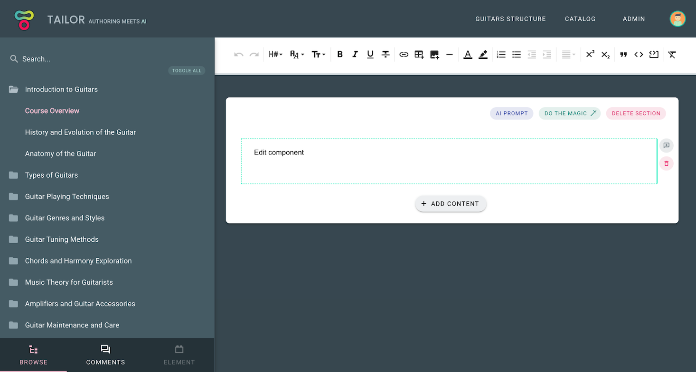

# Edit package

## Overview

Edit is the subpackage located under `packages/edit` exposing `Vue 2`
components needed for the Content Element authors to create a Content Element.
It consists of three main components:

- Edit component; main authoring component, required
- Top Toolbar component; exposing Content Element controls within
  the Tailor CMS top toolbar slot; optional
- Side Toolbar component; exposing Content Element controls within
  the Tailor CMS side toolbar slot; optional

In the example image below, you can see a WYSIWYG editor Edit component
(displaying 'Edit component' text) and its Top Toolbar; exposing
various editor controls (mounted below the main application heading). Side
Toolbar is not exposed for this Content Element; in case if it was, it would be
visible upon element selection instead of Browse sidebar (note that element
tab in the bottom left corner is greyed out).

\


\
These are regular `Vue 2.7.x` components which are being passed element related
props:

- `:element`: object; Element entity containing all element related data
- `:isFocused`: boolean; Is element selected
- `:isDragged`: boolean; Is element being dragged; e.g. upon reordering
- `:isDisabled`: boolean; Should element be disabled; e.g. upon copy element seleciton

and observed for element related events:

- `@save` - Emit `data` object to be saved on the `element.data` property.
- `@delete` - Delete element (default control already exists)

\
As noted above, to store element state, simply emit `save` event passing an
object to store (which will be persisted on the `element.data` property). To set
the initial state of the `element.data` property, you need to define
the `initState` function. The `initState` function generates the initial
`element.data` value. For more details on how to do that, please visit the
State section.

Here is an example of a simple counter `Edit` component from the Introduction
section:

\
`Edit.vue`

```vue
<template>
  <div>
    <div>Times clicked: {{ element.data.count }}</div>
    <button @click="increment">Increment</button>
  </div>
</template>

<script setup lang="ts">
import { Element } from 'tce-manifest';

const props = defineProps<{ element: Element }>();
const emit = defineEmits(['save']);

const increment = () => {
  const { data } = props.element;
  const count = data.count + 1;
  emit('save', { ...data, count });
};
</script>
```

\
In the example above, component triggers `save` state event on each Increment
button click. Note how `data` object is recreated, rather than count value being
modified. Since data flow should be top-down it is important not to modify
the recieved value, but rather emit a new state (to avoid side-effects). After
the event has been triggered, change is recieved via prop (updated element
state). Similar goes for the TopToolbar:

\
`TopToolbar.vue`
```vue
<template>
  <button @click="decrement">Decrement</button>
</template>

<script setup lang="ts">
import { Element } from 'tce-manifest';

const props = defineProps<{ element: Element }>();
const emit = defineEmits(['save']);

const decrement = () => {
  const { data } = props.element;
  const count = data.count - 1;
  emit('save', { ...data, count });
};
</script>
```

## Communication between components

::: tip Info
Available in version >=0.1.0
:::

All authoring components have the `$elementBus` pub/sub mechanism available,
provided via Vue [provide/inject](https://v2.vuejs.org/v2/api/#provide-inject)
prop-drilling feature. To communicate between components, simply inject
`$elementBus` and `emit` the event.

\
`TopToolbar.vue`
```ts
<script setup lang="ts">
...
const elementBus = inject('$elementBus');

const decrement = () => {
  // Emit decrement event upon toolbar btn click
  elementBus.emit('decrement', { count });
};
...
</script>
```

\
Proceed by implementing a listener within the targeted component (using the `on` registration method):

\
`Edit.vue`
```ts
<script setup lang="ts">
...
const elementBus = inject('$elementBus');
elementBus.on('decrement', ({ count }) => console.log(count));
...
</script>
```

For more details on the entire pub/sub API see the
[vue-radio implementation](https://github.com/ExtensionEngine/tailor/blob/develop/packages/vue-radio/src/index.js).

## When to save the state ?

Depending on the type of the element, you might wonder what is the best
moment to persist element state. Most of the elements are observing isFocused
prop and triggering save state event upon user focusing out of the element.
Of course, this is not always possible, e.g. when element input needs to be
validated. In those cases we suggest explicit save button.

## Disabled state

Each Content Element needs to implement the `disabled` behaviour which is
activated when `isDisabled` prop is set to `true`. Disabled element
presentation is used for various features like observing Content Element
diff or for copy functionality (Content Element needs to be previewed in
order to be selected).
