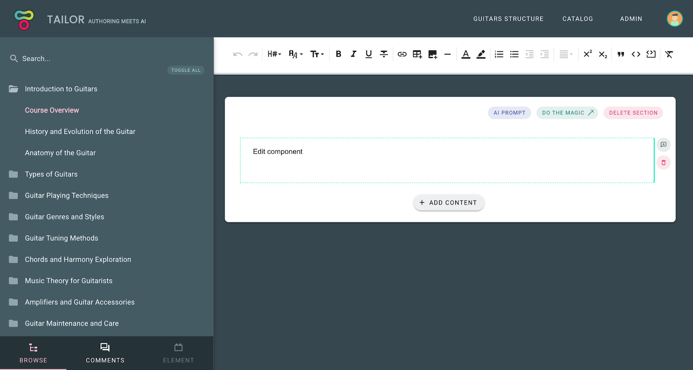

# Edit package

## Overview

Edit is the subpackage located under `packages/edit` exposing `Vue 3`
components. It is used by the Content Element authors to create a Content
Element. It consists of three main components:

- Edit component; main authoring component, required
- Top Toolbar component; exposing Content Element controls within
  the Tailor CMS top toolbar slot; optional
- Side Toolbar component; exposing Content Element controls within
  the Tailor CMS side toolbar slot; optional

In the example image below, you can see a WYSIWYG editor Edit component
(displaying 'Edit component' text) and its Top Toolbar; exposing
various editor controls (mounted below the main application heading). Side
Toolbar is not exposed for this Content Element; in case if it was, it would be
visible upon element selection instead of Browse sidebar (note that element
tab in the bottom left corner is greyed out).

\


\
These are regular `Vue` components which are being passed element related
props:

- `:element`: object; Element entity containing all element related data
- `:isFocused`: boolean; Is element selected
- `:isDragged`: boolean; Is element being dragged; e.g. upon reordering
- `:isReadonly`: boolean; Should element be readonly; e.g. upon copy element selection

and observed for element related events:

- `@save` - Emit `data` object to be saved on the `element.data` property.
- `@delete` - Delete element (default control already exists)

\
As noted above, to store element state, simply emit `save` event passing an
object to store (which will be persisted on the `element.data` property). To set
the initial state of the `element.data` property, you need to define
the `initState` function. The `initState` function generates the initial
`element.data` value. For more details on how to do that, please visit the
State section.

Here is an example of a simple counter `Edit` component from the Introduction
section:

\
`Edit.vue`

```vue
<template>
  <div>
    <div>Times clicked: {{ element.data.count }}</div>
    <button @click="increment">Increment</button>
  </div>
</template>

<script setup lang="ts">
import { Element } from 'tce-manifest';

const props = defineProps<{ element: Element }>();
const emit = defineEmits(['save']);

const increment = () => {
  const { data } = props.element;
  const count = data.count + 1;
  emit('save', { ...data, count });
};
</script>
```

\
In the example above, component triggers `save` state event on each Increment
button click. Note how `data` object is recreated, rather than count value being
modified. Since data flow should be top-down it is important not to modify
the received value, but rather emit a new state (to avoid side-effects). After
the event has been triggered, change is received via prop (updated element
state). Similar goes for the TopToolbar:

\
`TopToolbar.vue`
```vue
<template>
  <button @click="decrement">Decrement</button>
</template>

<script setup lang="ts">
import { Element } from 'tce-manifest';

const props = defineProps<{ element: Element }>();
const emit = defineEmits(['save']);

const decrement = () => {
  const { data } = props.element;
  const count = data.count - 1;
  emit('save', { ...data, count });
};
</script>
```

## Communication between components

::: tip Info
Available in version >=0.1.0
:::

All authoring components have the `$elementBus` pub/sub mechanism available,
provided via Vue [provide/inject](https://vuejs.org/guide/components/provide-inject)
feature. To communicate between components, simply inject
`$elementBus` and `emit` the event.

\
`TopToolbar.vue`
```vue
<script setup lang="ts">
...
const elementBus = inject('$elementBus');

const decrement = () => {
  // Emit decrement event upon toolbar btn click
  elementBus.emit('decrement', { count });
};
...
</script>
```

\
Proceed by implementing a listener within the targeted component (using the `on` registration method):

\
`Edit.vue`
```vue
<script setup lang="ts">
...
const elementBus = inject('$elementBus');
elementBus.on('decrement', ({ count }) => console.log(count));
...
</script>
```

For more details on the entire pub/sub API see the
[vue-radio implementation](https://github.com/ExtensionEngine/tailor/blob/develop/packages/vue-radio/src/index.js).

## Calling server procedures

All authoring components (Edit, TopToolbar, SideToolbar) can call custom
server-side methods defined in the server package via the injected
`$rpc` function.

```vue
<script setup lang="ts">
import type { RpcCaller } from '@tailor-cms/cek-common';

const rpc = inject('$rpc') as RpcCaller;

const generateSummary = async () => {
  // Type the return value via generic
  const result = await rpc<{ summary: string }>('generateSummary', {
    prompt: 'Summarize this content',
  });
  console.log(result.summary);
};
</script>
```

The `RpcCaller` type is exported from `@tailor-cms/cek-common`. Its
signature is `<T = any>(procedure: string, payload?: any) => Promise<T>` — the
generic `T` lets you type the return value at each call site. When omitted it
defaults to `any`. The `procedure` parameter maps to a key in the server
package's `procedures` export. For details on defining server procedures, see
the [Server package - Server procedures](/server-package#server-procedures-rpc)
section.

## When to save the state?

Depending on the type of the element, you might wonder what is the best
moment to persist element state. Most of the elements are observing isFocused
prop and triggering save state event upon user focusing out of the element.
Of course, this is not always possible, e.g. when element input needs to be
validated. In those cases we suggest explicit save button.

## Readonly state

Each Content Element needs to implement the `readonly` behaviour which is
activated when `isReadonly` prop is set to `true`. Readonly element
presentation is used for various features like observing Content Element
diff or for copy functionality (Content Element needs to be previewed in
order to be selected).


## Composite Elements

Content elements can be configured as composite elements using the `isComposite`
flag in the manifest. To include a list of embedded child elements, utilize the
`TailorEmbeddedContainer` global component. Tailor CMS will render the appropriate
element list, while the CEK runtime will mock example elements.

The `TailorEmbeddedContainer` component accepts the following props:
- `:container`: object; Data field of the element containing `embeds` in a key-value format.
- `:allowed-elements-config`: array; Array of element configs allowed to be embedded. Usually equals to the `embedElementConfig` prop passed to the Edit package.
- `:isReadonly`: boolean; Indicates if the element should be readonly. Defaults to `false`.
- `:enableAdd`: boolean; Indicates if adding new elements is allowed. Defaults to `true`.
- `:addElementOptions`: object; Additional options passed to the AddElement core component.

## Question Elements

Content elements can be configured as question elements using the `isQuestion`
flag in the manifest. Question elements require `isComposite: true` as well,
because the question prompt uses `TailorEmbeddedContainer` under the hood.

### CEK runtime: QuestionCard

When `isQuestion` is set, the CEK runtime wraps the Edit component in a
`QuestionCard` — a card UI with a type/icon header, form validation, dirty
tracking, and Save/Cancel controls.

The `QuestionCard` accepts an `autosave` prop (defaults to `false` for question
elements):

- **`autosave: false`**: Shows Save/Cancel buttons when the element has unsaved
  changes. The form is validated on submit.
- **`autosave: true`**: Changes are persisted immediately on every `@update`
  received. The form validates on input. No Save/Cancel buttons are shown.

The autosave toggle is available in the Settings panel for question elements.

Unlike regular elements (where `@save` emits the full `data` object and
persists immediately), Edit components inside QuestionCard emit `@update` with
partial data (only the changed fields). The `QuestionCard` merges the update
into its local state and handles persistence via Save/Cancel controls (or
immediately when `autosave` is enabled).

```vue
<script setup lang="ts">
const emit = defineEmits(['update']);

// Emit only changed fields (QuestionCard merges them)
emit('update', { answer: newValue });
</script>
```

### QuestionContainer

Question Edit components should use `QuestionContainer` from
`@tailor-cms/core-components` to wrap the answer UI. It provides the standard
question layout: question prompt (using `TailorEmbeddedContainer`), a default
slot for the answer UI, hint, and optionally feedback.

```vue
<template>
  <QuestionContainer
    :element-data="element.data"
    :embed-element-config="embedElementConfig"
    :is-disabled="isReadonly"
    :show-feedback="true"
    @update="onUpdate"
  >
    <!-- Your answer UI in the default slot -->
  </QuestionContainer>
</template>

<script setup>
import { QuestionContainer } from '@tailor-cms/core-components';
...
// Forward QuestionContainer updates (hint, feedback, prompt embeds)
const onUpdate = (data) => emit('update', data);
</script>
```

The `QuestionContainer` component accepts the following props:
- `:elementData`: object; The element's `data` object
- `:embedElementConfig`: array; Array of element configs allowed for the question prompt's embedded elements
- `:isDisabled`: boolean; Disable editing
- `:isReadonly`: boolean; Should element be readonly; e.g. upon copy element selection
- `:showFeedback`: boolean; Controls whether QuestionContainer should render feedback component

And emits:
- `@update`: object; Partial data update (hint, feedback, question/embeds changes from sub-components)

### Question element state shape

Question elements follow a specific data structure:

```ts
interface QuestionElementData {
  // Array of embed IDs that form the question prompt
  question: string[];
  // Key-value map of embedded elements (prompt parts, answer options, etc.)
  embeds: Record<string, ContentElement>;
  // Whether this question is gradable (has correct answers)
  isGradable: boolean;
  // Correct answer data (shape varies by question type, present when isGradable)
  correct?: any;
  // ... additional type-specific fields
}
```

### `isGradable` behavior

The `isGradable` flag controls whether a question element tracks correct
answers:

- When `isGradable: true` — the element includes a `correct` field in its data
  and the Edit UI shows answer correctness controls
- When `isGradable: false` — the `correct` field is removed and the element
  functions as a survey/poll question without grading
- The flag can be toggled at runtime via the Settings panel in the CEK, or
  via the element configuration in Tailor CMS. Toggling resets the element
  data to `initState` with the new `isGradable` value.
