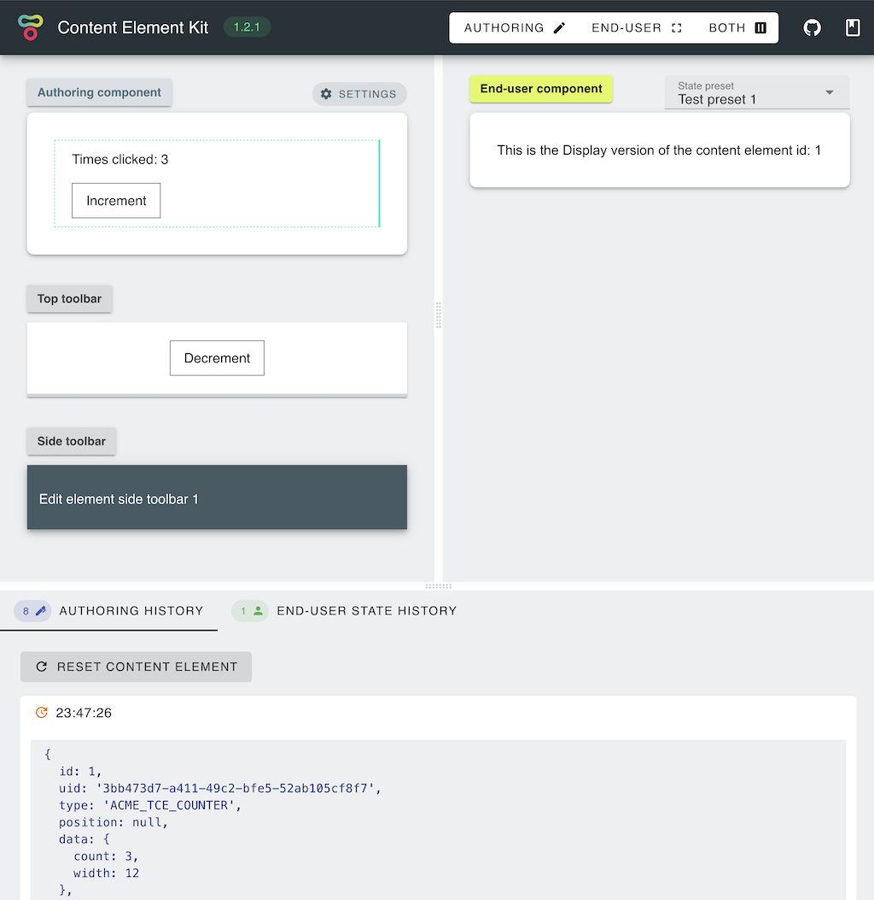
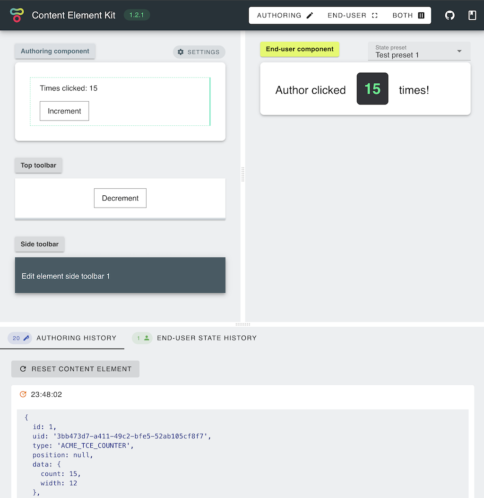

# Example

## Introduction

The goal of this section is to give a hands-on example on how to create a
simple content element. We'll be creating a simple counter, with a bit of a
twist to demonstrate the server side hooks.

::: tip Make sure you install prerequisites first!
For more details visit the Installation section.
:::

Let's start by initializing a new project:

```bash
npx @tailor-cms/tce-template
```

name it `tce-counter` and follow the instructions.

```bash
cd tce-counter
pnpm dev
```

your browser should pop up and display the preview. During the initial boot
components will reload few times, and it might take some time for `Edit`
component (left panel) to show up.

::: tip Note ☝️
In case the Edit component does not show up within 30 seconds, please restart.
There is a reported defect appearing on the first boot while dependencies
are being optimized.
:::


## Content Element manifest

Let's continue by editing Content Element manifest; defining basic properties
like name and type. In your editor of choice, open
`packages/manifest/src/index.ts` and modify name and type properties:

```ts
// Element unique id within the target system (e.g. Tailor)
export const type = 'ACME/TCE_COUNTER';

// Display name (e.g. shown to the author within add element dialog)
export const name = 'Simple counter';
```

There is also an `initState` function, which as name implies, initializes state
of the element upon creation. Since we are bulding a simple increment element,
we'll define it as:

```ts
export const initState: DataInitializer = (): ElementData => ({ count: 0 });
```

We also want to update the type definitions, to do so, open
`packages/manifest/src/interfaces.ts` and update `ElementData` interface:

```ts
export interface ElementData {
  count: number;
}
```

Upon starting the runtime, the server state should now reflect these changes
displaying updated type and setting the `data.count` value to `0`:


## Edit component

Now that we set the basic properties and specified how to initialize the
component state, we can create Authoring component for our counter. It is
not going to be the worlds most complex or usefull component; Author will
have an option to click on a button, each time incrementing a counter. Since
latest Tailor CMS develop uses `Vue 2.7`, we can use `Composition API`
to achive consistency with our `Display` component codebase (`Vue 3`). Navigate
to `packages/edit/src/components/Edit.vue` and paste the following code
for our simple counter:

```vue
<template>
  <div class="tce-container">
    <div>Times clicked: {{ element.data.count }}</div>
    <button @click="increment">Increment</button>
  </div>
</template>

<script setup lang="ts">
import { Element } from 'tce-manifest';

const props = defineProps<{ element: Element; isFocused: boolean }>();
const emit = defineEmits(['save']);

const increment = () => {
  const { data } = props.element;
  const count = data.count + 1;
  emit('save', { ...data, count });
};
</script>

<style scoped>
.tce-container {
  background-color: transparent;
  margin-top: 1rem;
  padding: 1rem;
  border: 2px dashed #888;
  font-family: Arial, Helvetica, sans-serif;
  font-size: 1rem;
}

button {
  margin-top: 1rem;
  padding: 0.5rem 1rem;
  border: 1px solid #444;
  background-color: #fff;
}
</style>
```

::: tip Note ☝️
We imported type definitions from the manifest package to enable code
completion and specify input.
:::

You should be able to see our Edit component and click on the increment button.
As you are clicking on the `Increment` button, you should see both; the
front-end component and the server state being modified to the same value
(as upon emitting the save event, data is being passed to the server runtime).


### Edit toolbar

We can implement the same functionality from the toolbars, as they will also
recieve element state and have the ability to save it.

Let's navigate to `packages/edit/src/components/TopToolbar.vue`, paste
the following code and save:

```vue
<template>
  <button @click="decrement">Decrement</button>
</template>

<script setup lang="ts">
import { Element } from 'tce-manifest';

const props = defineProps<{ element: Element }>();
const emit = defineEmits(['save']);

const decrement = () => {
  const { data } = props.element;
  const count = data.count - 1;
  emit('save', { ...data, count });
};
</script>

<style scoped>
button {
  margin-top: 1rem;
  padding: 0.5rem 1rem;
  border: 1px solid #444;
  background-color: #fff;
}
</style>
```

You sould be able to decrement the `count` by clicking on the Top Toolbar
Decrement button.



## Display component

Now that we created a Edit component, we can create our Lerner-facing
presentation component. For this particular example, Display component does
not contain any additional logic, it simply displays our counter value.
Navigate to `packages/display/src/components/Display.vue` and paste the
following code:

```vue
<template>
  <div class="tce-root">
    <div class="d-flex align-center text-h5">
      Author clicked
      <span class="counter">{{ data.count }}</span>
      times!
    </div>
  </div>
</template>

<script setup lang="ts">
import { ElementData } from 'tce-manifest';

defineProps<{ data: ElementData }>();
</script>

<style scoped>
.tce-root {
  background-color: transparent;
  margin-top: 1rem;
  padding: 1rem;
  border: 2px dashed #888;
  font-family: Arial, Helvetica, sans-serif;
  font-size: 1rem;
}

.counter {
  margin: 0 1rem;
  padding: 1rem;
  color: #23f48b;
  font-size: 2rem;
  font-weight: bold;
  background-color: #323338;
  border-radius: 0.5rem;
}
</style>
```

Note that Display component recieves element attributes as props. After
applying these changes you should be able to see the `Display` component:



## Server hooks

Finally, we are going to make one last change to our might counter by adding
some server-side behaviour. Server hooks are great place for interfacing
with external APIs (e.g. create a video upload link), validating inputs,
handling secrets and preparing the data for delivery (e.g. signing assets
to enable access).

In this example we are going to reset the counter in case it reaches 10.
Navigate to the `packages/server/src/index.ts` and update beforeSave function
to:

```ts
export function beforeSave(element: Element, services: any) {
  if (element.data.count >= 10) {
    element.data = {
      ...element.data,
      count: 0,
    };
  }
  return element;
}
```

Element is a Sequelize.js instance, with `data` defined as a JSONB property.
In order for Sequelize to detect changes, `data` property is entirely replaced
with a new value.

::: tip Note ☝️
In case that hook code changes are not picked up automatically, please restart.
:::

## Conclusion

Congradulations! You have created your first Content Element. For more details
on each of the components please visit the matching documentation section.
For a fully working example, please visit
https://github.com/tailor-cms/tce-counter.
