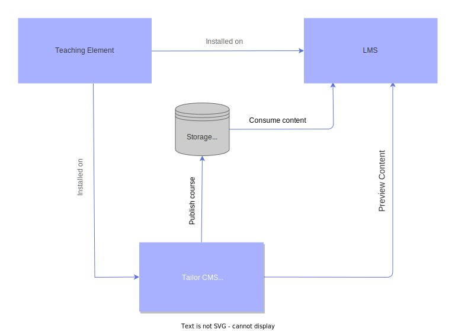

# Introduction

## Overview

Tailor is a headless CMS (Content Management System) built for crafting bespoke
learning experiences. It is highly configurable, enabling implementation of novel
learning pedagogies. Once authored, course content is published to the configured
external storage (usually Amazon S3) to be consumed by the targeted LMS
(Learning Management System) where Learners can interact with it.

## What are Content Elements?

Content elements are the essential building blocks of content inside Tailor CMS,
like Text, Image, Video, etc. Content Element Kit is a framework providing
the structure and runtime to simplify Content Element development. Framework
is organized as a monorepo, consisting of three main subpackages:

- `edit package`; providing means for Author to create a Content
  Element. This package targets Tailor CMS frontend, so components need to be
  implemented using the Vue 3 UI library.
- `display package`; for rendering the authored state. This package is used for
  target system and in theory can be implemented using any UI library. This
  version of Content Element Kit supports only Vue 3.
- `server package`; for implementing Content Element server side hooks. In addition
  to Tailor CMS, Content Element server side runtime needs to be implemented on
  the target (Display) system.

::: tip Note ☝️
There is an additional, internal, manifest package, providing shared key
information about the Content Element. You can learn more on this in the
following sections.
:::

