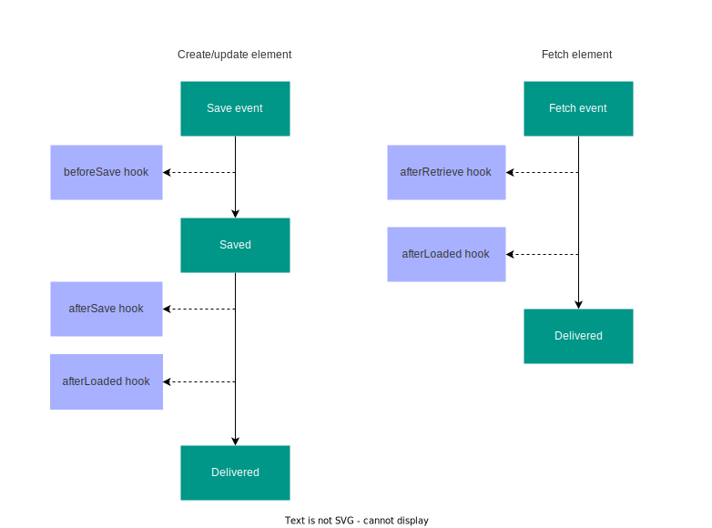

# Server package

Server subpackage is located under `packages/server`. It exposes
server-side hooks, which can be used for authoring and `end-user`
system.

## Content element hooks

The following hooks are available for managing content element data:

Create/update content element lifecycle:
  - `beforeSave`
  - `afterSave`
  - `afterLoaded`

Fetch element lifecycle:
  - `afterRetrieve`
  - `afterLoaded`

\


All hooks are called with 2 arguments. The first argument is the element itself,
and the second argument is the service bag which contains the config service
and the storage service (these services have not yet been ported into the
Content Element Kit). Hook declaration looks as follows:

```ts
function hook(element: SequelizeModel, services: Object) => element
```

The hook function returns the original or modified element. For example,
depending on the hook type, we can modify the element before saving it to the
database (beforeSave) or before delivering it to the frontend
(e.g., afterLoaded).

In the example section, we created a simple hook for our Counter element, which
resets the counter value if it reaches 10.

```ts
export function beforeSave(element, services) {
  if (element.data.count >= 10) {
    element.data = {
      ...element.data,
      count: 0,
    };
  }
  return element;
}
```
\
Hooks also enable interfacing with external libraries, server side validation
and secure operations (e.g. creating a secure direct upload link to hosting
service of choice).

::::tip ☝️ Note
All changes made by hooks are automatically propagated to the authoring
front-end using SSE (Server Side Events).
::::

## User state hooks

::::tip ☝️ Note
Available in versions >= 0.2.0.
::::

The server package enables user-state hooks, which one can use to manage
user-specific state of a particular element. There are two state hooks available:
  - `beforeDisplay`
  - `onUserInteraction`

The `end-user` system has the full flexibility for implementing the state
management and persistance. User-state hooks recieve `displaySystemContext`,
which can be provided by the `end-user` system and used to add additional context
needed for the state resolution. For content element kit this is
mocked within the element manifest and injected into previously listed hooks.

```ts
mocks?: {
  displayContexts: Array<{ name: string; data: any }>;
};
```
::::tip ☝️ Note
Only the first value is injected at the moment. In the future versions, the
system will ofer a dropdown to select the display context mock, in case one
wants to quickly mock different user states and switch between them.
::::

### `beforeDisplay` hook

`beforeDisplay` hook is responsible for resolving a user state of a particular
content element (binded as `userState` upon rendering the `Display` component).
The hook recieves authored content `element`, the end-user system
`displaySystemContext` and returns a resolved user state.

```ts
function beforeDisplay(
  element: Element,
  displaySystemContext: any) => UserState
```

### `onUserInteraction` hook

`onUserInteraction` hook is triggered when the `Display` components `emits` the
`@interaction` event. The hook recieves authored content `element`, the target
system `displaySystemContext` and the payload emitted by the `Display` component.

```ts
function onUserInteraction(
  element: Element,
  displaySystemContext: any,
  payload: any) => any
```

The `end-user` system is fully in control of the `displaySystemContext` provided
and the value returned by the `onUserInteraction` hook. If after the
`onUserInteraction` hook execution, there is a need to refresh the user state,
`onUserInteraction` hook should return `{ updateDisplayState: true }` flag,
which will result with invoking `beforeDisplay` hook and updating the
user state. In case you want to pass data to the `beforeDisplay` hook
from the `onUserInteraction` hook, simply return the `transientState` property
containing the data (alongside `updateDisplayState` flag). This will be
injected into `displaySystemContext` for you upon the `beforeDisplay` hook call.

### Mocking `end-user` system state persistance and handling

In addition to the context mock, one might want to mimick the persistance and
context handling mechanism. At the moment, it is possible to rely on the
`CEK_RUNTIME` env variable to detect if the hook is running within the
development runtime and inject any arbitrary development specific code
in order to achieve this behaviour.
